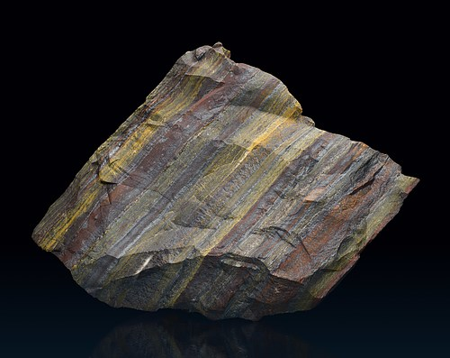
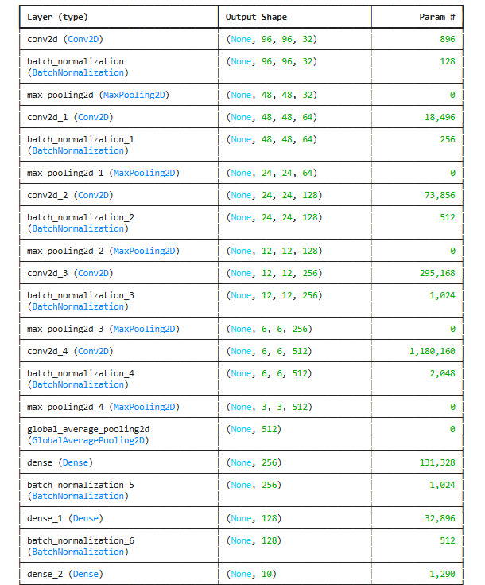
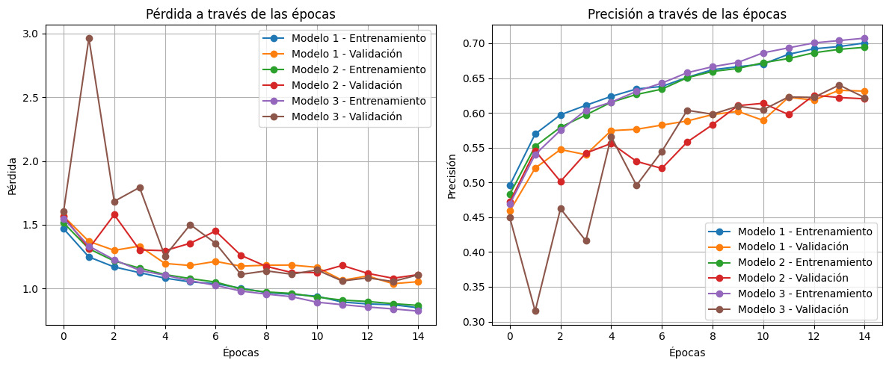
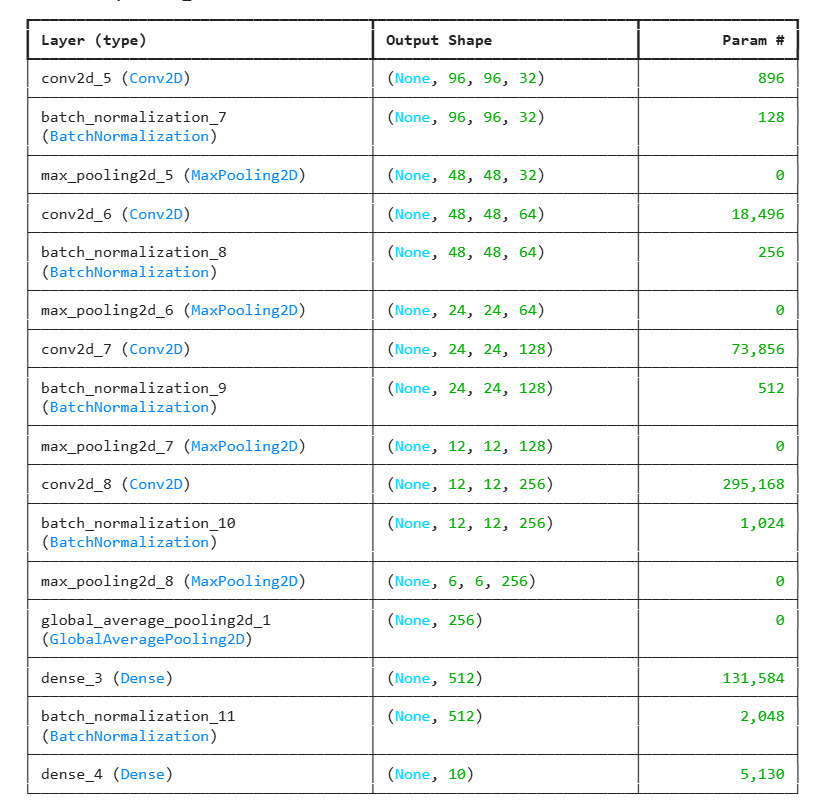
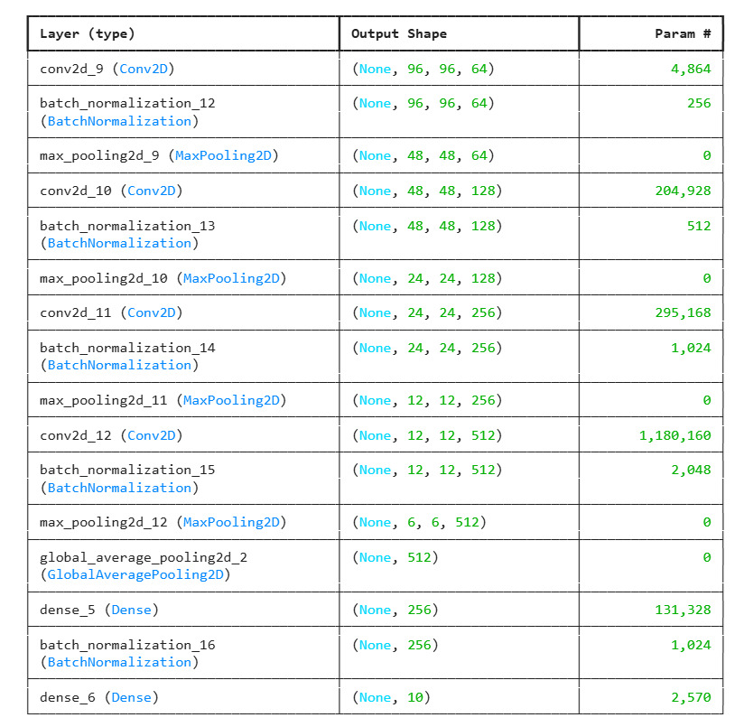
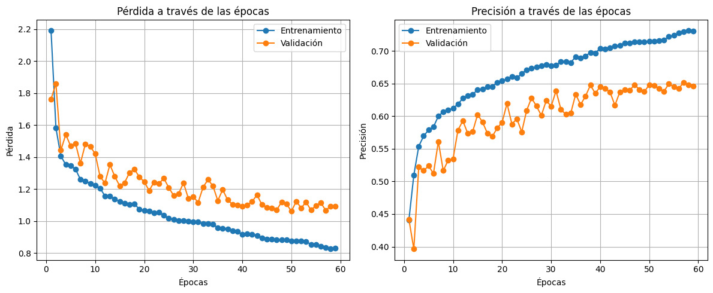

# Memoria Técnica

## Índice
- [Portada](#portada)
- [Alcance del proyecto](#alcance-del-proyecto)
  - [Objetivo](#objetivo)
  - [Introducción](#introducción)
- [Fuentes de información y procedimientos aplicados](#fuentes-de-información-y-procedimientos-aplicados)
  - [Construcción del modelo](#construcción-del-modelo)
  - [Resultados modelo](#resultados-modelo)
  - [Pruebas sobre el modelo](#pruebas-sobre-el-modelo)
  - [Conclusiones](#conclusiones)
- [Conclusiones generales](#conclusiones-generales)
- [Anexos](#anexos)

## Portada
- **Nombre del Proyecto**: Clasificador de Minerales
- **Fecha**: 31 de noviembre de 2024.
- **Glosario**: 
  - *Mineral*: Sustancia natural, de composición química definida. Normalmente sólido e inorgánico, y con cierta estructura cristalina.
  - *Variedad*: Grupo de minerales que tienen una estructura cristalina determinada y una composición química en un rango de variaciones continuas.
  - *Cuarzo*: El cuarzo es un mineral compuesto de sílice (SiO2), el segundo más común en la corteza terrestre, después del feldespato.
  - *[MinDat](https://www.mindat.org/)*: Base de datos abierta con imágenes de minerales, rocas y meteoritos.

## Alcance del proyecto

### Objetivo
Los minerales presentan características complejas a simple vista, sin embargo, la clasificación precisa de estos es necesaria para diversas aplicaciones en la geología y en la minería. 
Inspirado en ello, el objetivo es hacer un clasificador de minerales que sea capaz de identificar imágenes pertenecientes a 10 categorías distintas, 
mediante una red neuronal convolucional entrenada desde cero con imágenes obtenidas de MinDat.

### Introducción
La clasificación de minerales es una tarea compleja para la mayoria de las personas, 
por sus características visuales únicas, pero hacer un clasificador de minerales 
capaz de superar a expertos en la materia es bastante difícil. Después del 
preprocesamiento para eliminar el fondo de las imágenes, la elección de una arquitectura
de red neuronal convolucional presenta otro reto debido al nivel de abstracción de las 
imágenes y el costo computacional de los entrenamientos.

## Fuentes de información y procedimientos aplicados
El conjunto de datos obtenidos del [repositorio](https://github.com/loliverhennigh/MinDat-Mineral-Image-Dataset.git) de Oliver Hennigh pertenecen a diferentes clasificaciones de minerales. Este repositorio alberga un archivo .csv, el cual guarda información sobre la imagen y su clasificación.
Así esta información se ocupo después para comparar las predicciones con los datos reales.

Los tres modelos presentados tienen una arquitectura similar, sin embargo hemos resaltado los puntos más importantes que los diferencian entre si.

## Modelo 1

## Construcción del Modelo 
La red que construiremos se basa en una arquitectura de **red neuronal convolucional (CNN)**, una técnica ideal para problemas de visión por computadora. Las CNNs son capaces de extraer características clave de las imágenes, como texturas, bordes y patrones complejos. 

## Arquitectura

**Totales**
- Total params: 1,739,594 (6.64 MB)
- Trainable params: 1,736,842 (6.63 MB)
- Non-trainable params: 2,752 (10.75 KB)

## Funcionamiento del Modelo 
1. Las imágenes se pasan a través de cinco capas convolucionales para extraer características espaciales.
2. Las capas de MaxPooling reducen las dimensiones de las características.
3. Las dos capas densas realizan la clasificación basada en las características extraídas.
4. Capa de salida. Una sola neurona con una función de activación produce una probabilidad entre 0 y 1, desplegando la probabilidad más alta de que la imagen pertenezca a alguna de la categorias.

## Resultados del Modelo 

### Precisión (Accuracy):
- Entrenamiento: La precisión alcanza valores cercanos a 0.7 rápidamente, indicando un ajuste bueno a los datos de entrenamiento.
- Validación: La precisión de validación es alta (~0.60-0.64), con ligeras oscilaciones en algunas épocas.

### Pérdida (Loss):
- Entrenamiento: La pérdida disminuye consistentemente y se estabiliza en valores bajos (~0.5), lo que refleja que el modelo está aprendiendo adecuadamente.
- Validación: La pérdida de validación es baja.

## Pruebas sobre el modelo
Después de elegir el modelo final, se hace el ajuste de hiperparámetros de 
regularización en las últimas dos capas de convolución y dropout sólo en la 
capa densa, para evitar el sobreajuste de la red.

## Conclusiones

En general este modelo podría obtuvo buenos resultados en tareas complejas, pero requiere de un ajuste cuidadoso de los hiperparámetros para evitar el sobreajuste.
Debido a que tanto en el entrenamiento como en la validación la precisión se aproxima a 0.7.
 
# Modelo 2

### Construcción del Modelo 
La red que construiremos se basa en una arquitectura de **red neuronal convolucional (CNN)**, una técnica ideal para problemas de visión por computadora. Las CNNs son capaces de extraer características clave de las imágenes, como texturas, bordes y patrones complejos. 

## Arquitectura

**Totales**
- Total params: 529,098 (2.02 MB)
- Trainable params: 527,114 (2.01 MB)
- Non-trainable params: 1,984 (7.75 KB)

### Funcionamiento del Modelo 
1. Las imágenes se pasan a través de cuatro capas convolucionales para extraer características espaciales.
2. Las capas de MaxPooling reducen las dimensiones de las características.
3. Una capa densa que realiza la clasificación basada en las características extraídas.
4. Capa de salida. Una sola neurona con una función de activación produce una probabilidad entre 0 y 1, desplegando la probabilidad más alta de que la imagen pertenezca a alguna de la categorias.

### Resultados del Modelo 

## Precisión (Accuracy):
- Entrenamiento: La precisión alcanza valores cercanos a 0.68 rápidamente, indicando un ajuste bueno a los datos de entrenamiento, pero menor al modelo 1.
- Validación: La precisión de validación es alta (~0.60-0.62), con ligeras oscilaciones en algunas épocas.

## Pérdida (Loss):
- Entrenamiento: La pérdida disminuye consistentemente y se estabiliza en valores bajos (~0.5), lo que refleja que el modelo está aprendiendo adecuadamente.
- Validación: La pérdida de validación es baja.

### Pruebas sobre el modelo
Después de elegir el modelo final, se hace el ajuste de hiperparámetros de 
regularización en las últimas dos capas de convolución y dropout sólo en la 
capa densa, para evitar el sobreajuste de la red.

### Conclusiones

En general este modelo obtuvo buenos resultados en tareas complejas. Con una sola capa densa, este modelo es más simple y puede ser menos propenso a sobreajustarse, pero podría tener una capacidad de aprendizaje más limitada.

# Modelo 3

### Construcción del Modelo 
La red que construiremos se basa en una arquitectura de **red neuronal convolucional (CNN)**, una técnica ideal para problemas de visión por computadora. Las CNNs son capaces de extraer características clave de las imágenes, como texturas, bordes y patrones complejos. 

## Arquitectura

**Totales**
- Total params: 529,098 (2.02 MB)
- Trainable params: 527,114 (2.01 MB)
- Non-trainable params: 1,984 (7.75 KB)

### Funcionamiento del Modelo 
1. Las imágenes se pasan a través de cuatro capas convolucionales para extraer características espaciales.
2. Las capas de MaxPooling reducen las dimensiones de las características.
3. Una capa densa que realiza la clasificación basada en las características extraídas.
4. Capa de salida. Una sola neurona con una función de activación produce una probabilidad entre 0 y 1, desplegando la probabilidad más alta de que la imagen pertenezca a alguna de la categorias.

### Resultados del Modelo 

## Precisión (Accuracy):
- Entrenamiento: La precisión alcanza valores cercanos a 0.72 rápidamente, indicando un ajuste bueno a los datos de entrenamiento, y mejor al modelo 1 y 2.
- Validación: La precisión de validación es alta (~0.60-0.62), con ligeras oscilaciones en algunas épocas.

## Pérdida (Loss):
- Entrenamiento: La pérdida disminuye consistentemente y se estabiliza en valores bajos (~0.5), lo que refleja que el modelo está aprendiendo adecuadamente.
- Validación: La pérdida de validación es baja.

### Pruebas sobre el modelo
Después de elegir el modelo final, se hace el ajuste de hiperparámetros de 
regularización en las últimas dos capas de convolución y dropout sólo en la 
capa densa, para evitar el sobreajuste de la red.

### Conclusiones

En general este modelo fue el que obtuvo mejores resultados resultados. Con una sola capa densa, la variación en los tamaños de kernel y el mayor número de filtros inicial le permiten capturar mejores características, pero requiere de más datos de entrenamiento y posiblemente de técnicas de regularización.

## Conclusiones generales
Después de la comparativa entre modelos se eligió el modelo 3 y al añadir técnicas de regularización se nota una mejora en la precisión 
obtenida en el conjunto de validación. Sin embargo, se ralentiza el entrenamiento de la red, 
por lo que hay aún una ventana de mejora en cuanto a la precisión que es posible alcanzar, 
pues se ha alcanzado un 73% de precisión después del entrenamiento final, cuando 
los primeros modelos sobreajustados alcanzaron un 84% de precisión.

A pesar de que existen miles de minerales en la naturaleza y varios métodos para 
su identificación, la clasificación de estos sólamente por métodos visuales presenta 
una serie de dificultades que aumentan considerablemente conforme se desea trabajar 
con más categorías, gracias a las variaciones que estos objetos presentan por lo que 
pueden ser confundidos fácilmente. Contando con más tiempo y capacidad de cómputo 
sería posible mejorar e incluso extender el modelo, mediante la exploración de otras 
técnicas y un ajuste más profundo de los parámetros escogidos.

## Anexos
- Flujo de trabajo:
  - Visualización del conjunto de datos: [viewing_data.ipynb](viewing_data.ipynb)
  - Selección de categorías a descargar: [filter_url_list.py](filter_url_list.py)
  - Descarga de las imágenes: [download_images.py](download_images.py)
  - Desestimación de imágenes con otras extensiones: [remove_png_images.py](remove_png_images.py)
  - Selección de imágenes para el entrenamiento: [remove_extra_images.py](remove_extra_images.py)
  - Preprocesamiento de imágenes: [process_images.py](process_images.py)
  - Creación de subcarpetas para alimentar el modelo [create_subfolders.py](create_subfolders.py)
  - Entrenamiento y comparación de modelos: [training_models.ipynb](training_models.ipynb)
  - Ajuste de hiperparámetros: [tuning_parameters.ipynb](tuning_parameters.ipynb)
  - Entrenamiento final del modelo ajustado: [cnn_model.py](cnn_model.py)
  - Modelo entrenado: [trained_model.keras](api/models/trained_model.keras)
  - Predicción del modelo que usa la API: [predict.py](api/predict.py)
  - Procesamiento de imágenes que recibirá la API: [process_images_api.py](api/utils/process_images_api.py)
  - Código principal para el funcionamiento de la API: [main.py](api/main.py)
  - Dockerfile para la API en contenedor: [Dockerfile](Dockerfile)
- [Repositorio en GitHub](https://github.com/vick08bv/Clasificador-Minerales)
